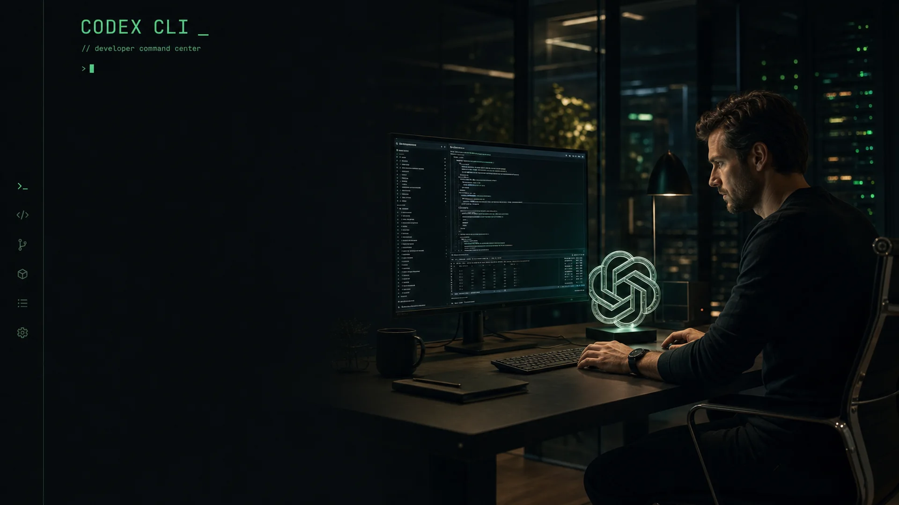

# LingGlow / 灵妆

**macOS AI Agent 主题、皮肤与个性化管理工具，支持 Codex/GPT、WorkBuddy 与豆包。**  
**A macOS theme and skin manager for Codex/GPT, WorkBuddy, and Doubao.**

[官方网站](https://aiaiai.homes/) · [下载最新版](https://github.com/AI-Scarlett/LingGlow/releases/latest) · [皮肤图鉴](catalog/v1/GALLERY.md) · [安装手册](docs/USER-GUIDE.md) · [English](#english)

灵妆让用户无需修改 Agent 源码，即可浏览、下载、更新和应用经过完整性校验的主题皮肤。它会根据目标客户端与深浅模式处理背景、文字、卡片、弹窗、输入框、首页专图与 WorkBuddy 机器人图片，并保留恢复官方原版的入口。

> 本仓库只发布签名公证安装包、远程皮肤目录、皮肤预览、用户文档和皮肤制作 Skill，**不发布灵妆应用源码**。

## 当前公开版本：2.3.10

- 修复本机 7 天免费 VIP 试用仍有效时，已试用过的单套 VIP 皮肤被错误拒绝的问题。
- 修复原生界面与启动流程并发拉起服务造成的冷启动误报，并在服务恢复后补载商品目录、清理旧错误提示。
- 皮肤页新增“更新全部”，串行更新当前 Agent 的全部可更新皮肤并汇总结果。
- 移除含义不明的灰色盾牌和误导性的“仅预览/待验证”归因；Agent 安全或适配问题现在由 Agent 状态区明确说明。
- 正式适配 WorkBuddy 5.3.3，覆盖背景、品牌、导航、发送/停止控件、项目 Hero 与输入区头像，并完成真机恢复验证。

[查看 LingGlow 2.3.10 完整更新说明](https://github.com/AI-Scarlett/LingGlow/releases/tag/v2.3.10)

## 2026-07-23 Agent 科技核心与写实系列

本次目录新增 14 套写实/电影感三端皮肤：

- VIP Agent 科技核心系列：Codex CLI、Claude Code、Grok、OpenClaw、Hermes、Cursor、Antigravity CLI、GitHub Copilot CLI、Qwen Code、Kimi Code。
- VIP 人物系列：爱因斯坦·普林斯顿书房。
- 免费游戏系列：王者荣耀·云巅峡谷、绝地求生·艾伦格终局、无畏契约·亚海悬城。

10 套 Agent 主题全部采用无人物设计：不是把 Logo 贴在房间里，而是把 Logo/Icon 变成正在运行的算力核心、推理引擎、编译晶格或数据路由装置，并连接终端、光子总线、遥测和机器人基础设施。

每套都使用独立的 16:10 全局背景、16:9 WorkBuddy/豆包首页 Hero、3:1 Codex 首页横幅和透明品牌/角色头像，并声明固定 light/dark 语义配色。相关品牌与角色主题均为非官方粉丝创作，不代表品牌方合作或背书。

## 主打皮肤 / Featured Skins

| Codex CLI | 爱因斯坦 | 王者荣耀 | 绝地求生 |
|---|---|---|---|
|  |  |  |  |
| VIP · Agent CLI · 深色 | VIP · 人物 · 深色 | 免费 · 游戏 · 浅色 | 免费 · 游戏 · 深色 |

当前目录共 39 套皮肤，其中 21 套免费、18 套 VIP。八仙九套、三套写实游戏与世界杯夺冠主题均为免费皮肤。

## 核心能力

- **三端管理**：Codex/GPT、WorkBuddy、豆包使用各自真实客户端图标与独立适配能力。
- **按需下载**：DMG 不再携带全部大图，用户只下载需要的皮肤。
- **我的皮肤**：统一查看已下载、已购买、适用 Agent 和更新状态。
- **推荐陈列**：通过 `featured` 元数据持续上新主打皮肤，不要求升级 App。
- **深浅模式**：皮肤声明 light/dark，语义文字和控件颜色不直接套用背景图颜色。
- **安全目录**：只允许声明式 JSON 与静态 WebP，包、定义文件和图片均校验 SHA-256。
- **安全更新**：App 更新校验摘要、Bundle ID、Developer Team ID、Developer ID 签名与 Apple 公证。
- **可恢复**：应用前检查客户端签名和兼容级别，并保留恢复官方原版入口。

## 下载与安装

前往 [GitHub Releases](https://github.com/AI-Scarlett/LingGlow/releases/latest)：

- 下载当前 Release 中的 `LingGlow-2.3.10-macOS.dmg` 和 `SHA256SUMS`
- 系统要求：macOS 13 或更高版本

只从本仓库的正式 Release 下载。DMG 与 App 使用 Developer ID 签名并附加 Apple 公证票据；完整步骤见 [安装与使用手册](docs/USER-GUIDE.md)。

## 皮肤下载与更新

1. 打开灵妆并选择 WorkBuddy、豆包或 Codex/GPT。
2. 在“推荐”或“全部”浏览预览，点击“下载”。
3. 在“我的皮肤”查看已下载、已购买和有更新的皮肤。
4. 点击“应用”，确认后仅重启所选 Agent。
5. 需要撤销时点击“恢复原版”。

远程目录：[catalog/v1/index.json](catalog/v1/index.json)  
完整图鉴：[catalog/v1/GALLERY.md](catalog/v1/GALLERY.md)

## 购买、授权与隐私

购买前必须勾选《购买说明》和《隐私政策》。未勾选时购买按钮仍可点击，但会弹窗要求阅读并同意后才能进入 Dodo Payments 官方托管支付页。

- [隐私政策](docs/PRIVACY.md)
- [购买说明](docs/PURCHASE-TERMS.md)
- 数字授权与虚拟皮肤除适用法律或 Dodo Payments 规则另有规定外不支持退货退款
- 客户端不嵌入商户 API Key，不收集银行卡信息

## 使用 Skill 制作皮肤

[`skills/skin-abstract`](skills/skin-abstract) 提供统一的三端皮肤制作流程，包括图片规格、深浅模式、语义对比度、Codex 首页专图、WorkBuddy 悬浮主体透明度/留白校验，以及新任务与历史任务输入框的真实客户端 QA。不合格素材会保留默认机器人，不会退化成背景裁图或圆形头像。

查看 [使用 Skin Skill 制作皮肤](docs/CREATE-SKIN-WITH-SKILL.md)。

## English

LingGlow is a macOS AI agent theme and skin manager for **Codex/GPT, WorkBuddy, and Doubao**. It provides a remote skin catalog, featured collections, a personal “My Skins” library, per-agent compatibility labels, verified downloads, light/dark appearance profiles, secure app updates, and a reusable skin-authoring Skill.

- Official website: [https://aiaiai.homes/](https://aiaiai.homes/)
- Download: [Latest GitHub Release](https://github.com/AI-Scarlett/LingGlow/releases/latest)
- Supported languages: Simplified Chinese and English
- Supported platform: macOS 13+
- Supported clients: Codex/GPT, WorkBuddy, Doubao

## FAQ

### Is LingGlow an official OpenAI, WorkBuddy, or Doubao product?

No. LingGlow is an independent personalization utility and is not affiliated with or endorsed by those client vendors.

### Does LingGlow modify conversations or account data?

No. Skin packages contain declarative theme data and static images. LingGlow does not copy client login data or conversation content.

### Why are some effects limited?

LingGlow fails closed when a client version or capability has not been verified. Generic-safe mode only applies capabilities considered safe for the detected build.

### Can skins update without reinstalling LingGlow?

Yes. App updates and skin catalog updates use separate channels.

## Repository Contents

- `catalog/v1/`: remote catalog, metadata, and preview gallery
- `skills/skin-abstract/`: reusable skin creation Skill
- `docs/`: installation, creation, privacy, purchase, and product facts
- `latest.json`: signed-release update manifest
- Releases: notarized DMGs, checksums, and downloadable skin bundles

**Search topics:** macOS AI agent themes, Codex themes, ChatGPT desktop skins, WorkBuddy themes, Doubao skins, AI assistant personalization, macOS skin manager, 灵妆, Codex 换肤, WorkBuddy 皮肤, 豆包皮肤。
