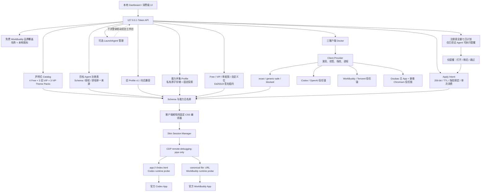
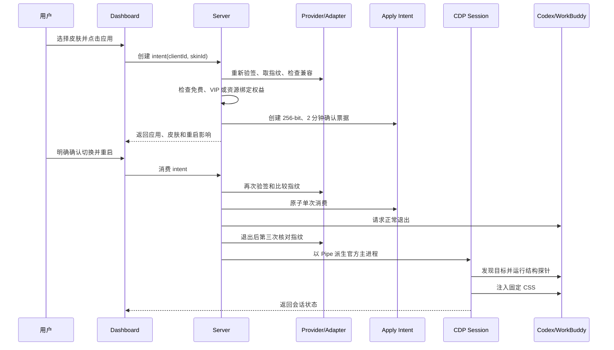

# v2 架构

灵妆（LingGlow）v2 是一套本机消费级换肤工作台：同一个产品层管理 Codex、WorkBuddy 与处于静态审计阶段的 Doubao，客户端差异收敛在 Provider、Adapter、运行时探针和 CSS 编译器中。皮肤、会员和排程都不能直接触达 CDP；任何会重启客户端的操作必须经过一次性 Apply Intent。Doubao 当前 `transportVerified=false`、`capabilities=[]`，不进入注入路径。



虚线登录路径只表示用户显式安装的后台提醒入口。它不会自动应用皮肤；提醒最终仍回到 Apply Intent 确认。

## 模块职责

### 客户端与兼容层

- `src/client-registry.mjs`：目标 Agent 的单一注册表；Schema、发现、授权租约、排程和 legacy catalog 范围从这里导出，避免新增 Agent 时散落复制 client ID 列表。
- `src/client-app.mjs`：Codex/WorkBuddy/Doubao Provider；内置信任锚、App 发现、代码签名与 sealed resources 校验、ASAR 或 Doubao 嵌套 Chromium 资源指纹、静态前端信号、主进程分类、正常退出与原版启动。
- `src/transport-strategy.mjs`：可单测的传输证据、target 白名单和启动策略。Doubao 优先 Pipe，仅预留隔离 Loopback，并明确拒绝内部 `49853` 端口。
- `src/codex-app.mjs`：旧 Codex 调用方的兼容导出，不再承载单客户端架构。
- `src/asar.mjs`：有界、只读的 ASAR 索引/小文件读取；拒绝路径越界，不解包或修改安装包。
- `src/adapter.mjs`：Adapter schema、内置 WorkBuddy 精确 Adapter、Doubao 零能力静态 Adapter、Codex 摘要锁定的 static-candidate、目标 URL/白名单解析和 `exact` / `generic-safe` / `blocked` 门禁。static-candidate 永远不会进入 exact，运行证据文件还要通过内容矩阵与摘要复核。

### 皮肤与产品层

- `src/catalog.mjs` + `catalog/`：保留 4 套 Free 与 3 套 VIP 的 legacy catalog v1，并从注册表读取其适用范围；`src/catalog/theme-pack.mjs` + `catalog/theme-packs/index.json` 另行注册跨 Agent Theme Pack，并锁定定义文件与静态 WebP 的双层 SHA-256。目录卡只显示经同一完整性校验链物化的本地真实预览素材。WorkBuddy/Codex 可物化，豆包当前只投影设计预览且 fail closed。
- `src/profile.mjs`：自定义方案 schema、静态 PNG/JPEG/WebP 容器与解码校验、容量配额、私有目录、备份和原子保存；同时管理无权益门禁的 WorkBuddy 名称/图标覆盖；仅 Codex 可生成官方 `codex-theme-v1` 分享串。
- `src/capability-schema.mjs`：WorkBuddy、Doubao 与 Codex 的能力并集字段目录、独立 capability map、字段级消费契约（运行时 CSS / 总开关 / Codex 手动官方主题导入）、编辑器字段投影和只消费 `supported` 字段的客户端编译投影；未知及不适用字段保持 round-trip。
- `src/union-profile.mjs`：要求 `{id,name,targetClientId,schemaVersion,values}` 的并集文档、可执行 `union-profiles/` 与仅设计 `union-profile-drafts/` 两个私有原子 store、symlink/hard-link/权限/容量门禁，以及只消费 `supported + legacyV1Path` 的固定 profile v1 桥接；豆包草稿在此层仍不能 bridge、compile 或注入，未来只能由用户显式提升。
- `src/entitlements.mjs`：Free/VIP/单皮肤/固定自定义位权限快照、Ed25519 租约验证和并集 profile 持久化授权判定。
- `src/products.mjs`：唯一的 Dodo Product ID 与消费者文案目录、三类 offer 映射及可信服务配置 readiness；Product ID 只参与路由，不能产生权益。
- `src/skin.mjs`：按客户端和能力交集生成固定 CSS；生成带顶层 frame/精确 URL 守卫的安装与清理脚本。

### 操作、安全与自动化层

- `src/apply-intents.mjs`：短时、内存态、单次使用的重启确认票据；绑定客户端与应用指纹，不保存完整 profile。
- `src/schedule.mjs`：注册表全量的 v2 七日排程、v1/v2 状态迁移、时区计算、持久化稍后提醒和每日一次提醒认领；只有目标成功确认并应用后才原子认领，未验证 Agent 的结构位置保留但不会保存可执行安排或产生提醒。
- `src/login-agent.mjs`：可选登录提醒 LaunchAgent 的状态、安装与卸载；拒绝覆盖陌生文件，不调用 `launchctl`。
- `src/cdp.mjs`：CDP Pipe 传输、客户端专用运行时探针、目标附加、固定脚本生命周期、清理、失败回滚与原版恢复。
- `src/server.mjs`：Dashboard API、认证/Origin/CSP、三客户端发现状态、catalog、能力 Schema/并集 Profile、权益、计划、提醒、登录代理、Apply Intent 和会话编排；受 Token 保护的 Codex 官方主题导出只读取已保存的 Codex 并集方案并返回手动导入文本，不接触目标进程；Doubao 可保存完整但隔离的 Schema 草稿，预览桥接、catalog、排程与注入仍保持 blocked。
- `src/cli.mjs`：Dashboard、三客户端 Doctor 与独立原版恢复。
- `public/`：面向消费者的目标切换、首页、皮肤库、自定义、七日排程、VIP、设置与诊断 UI；前端预览不接触目标应用。

## Provider 与信任锚

Provider 通过 `clientId` 选择内置策略：

| `clientId` | Bundle ID | Team ID | 静态入口 | 运行时目标 |
|---|---|---|---|---|
| `codex` | `com.openai.codex` | `2DC432GLL2` | `webview/index.html` | 仅 `app://-/index.html`（query/hash 可变） |
| `workbuddy` | `com.workbuddy.workbuddy` | `FN2V63AD2J` | `renderer/index.html` | 基于已验签 `app.asar` 生成的规范 `file:` URL |
| `doubao` | `com.bot.pc.doubao` | `96L78H6LMH` | 嵌套 Chromium Extension `side_panel.html` | 固定 Extension URL + `https://www.doubao.com/chat/*`；当前 blocked |

App 路径、版本、Build、Chromium、主可执行文件/Plist/ASAR 文件身份和 ASAR SHA-256 共同形成应用指纹。WorkBuddy 5.3.3 的腾讯 Editor SDK 运行日志会持续追加或在重启时重建，因此其 inode/size/mtime 不进入不可变代码指纹；每次 fresh 复核仍会独立校验固定路径、文件类型、owner、hard link、64 KiB 上限与代码签名。Doubao 还绑定主/嵌套 CDHash、Framework、manifest commit、Extension ID/版本与前端资源 SHA-256。Apply Intent 与启动前的竞态复核都使用这个指纹。

进程识别只接纳“主可执行文件无参数”和“主可执行文件 + 精确 `--remote-debugging-pipe`”两种完整命令，输出只含 PID 与传输分类，不把 WorkBuddy sidecar/daemon 的 argv 带进服务状态。

## Adapter 与能力交集

Adapter 是声明式兼容元数据，不是脚本。它必须匹配内置信任锚，并声明 version、build、ASAR SHA-256、必需静态信号、probe kind、目标和能力。Codex 5440 还声明 `validation.status=static-candidate`、静态基线摘要和运行证据类型；该状态只供 Doctor 呈现升级进度，不向编译器授予候选能力。

最终能力是以下条件的交集：

```text
客户端硬上限
∩ 兼容级别上限
∩ Adapter capabilities
∩ 皮肤声明字段
∩ 当前用户权益
```

`generic-safe` 固定只有 `background`、`palette`、`glass` 与防御性 `composer-avatar`。WorkBuddy 5.2.6 / 5.3.3 / 5.3.5 exact Adapter 另外只授予已审计的 `brand`、`navigation`、`controls` 和 `project-hero`；不会继承 Codex 的 Banner、Composer 或布局能力。能力并集 Profile 在进入此交集前还会先按 capability map 丢弃 `pending`、`unsupported`、未知和其他客户端字段。

## 目标 URL 与运行时探针

Codex 的自定义协议入口稳定地收敛到 `app://-/index.html`。WorkBuddy 使用 Electron `loadFile`，其 URL 会包含真实安装路径；因此 Adapter 只声明固定相对路径 `renderer/index.html`，运行时 URL 由 Provider 对已验签 `app.asar` 计算，避免把某台机器的 `/Applications/...` 写进 Adapter。Doubao 只声明精确 Extension Side Panel 和 `https://www.doubao.com/chat/*`；当前没有传输验证，因此 Session Manager 不会附加这些目标。

目标发现后，Session Manager 会：

1. 精确比较 base URL；
2. 附加页面并运行客户端专用只读结构探针；
3. 注册新文档脚本，并立即应用当前文档；
4. 检查固定 style/profile 标记确实存在；
5. 周期性发现新页面，仅对同样通过门禁的目标重复此流程；
6. 停用时注销脚本、清理当前页面并确认标记消失。

## 一次换肤的完整生命周期



恢复原版走同样的 intent 确认，只是最终注销/清理脚本、正常退出调试进程，并以无调试参数启动重新验签后的官方 App。直接重启接口已停用。

## Catalog、VIP 与自定义

内置 catalog 是随应用发布、可代码审查的 JSON。权益只影响“能否保存和应用”，不会改变 Adapter 或 CDP 权限。免费用户可以用显式 `unionProfile` 做纯内存预览，但不能持久化；有效 VIP 可创建/更新并集方案，`custom_slot_once` 只能写入服务端租约已绑定的固定 `profileId`，只购买单套皮肤不能创建自定义方案。已保存且有权使用的并集方案复用现有 Apply Intent，确认阶段会重新读取文件、权益与应用指纹。

四个 Dodo 测试商品已经进入单一只读目录，并由 `GET /api/products` 向 Web/原生界面投影公开字段。仓库已实现独立的可信 Checkout/Webhook/License/PostgreSQL 服务、桌面 Keychain 桥和 Ed25519 租约验签，但当前没有部署账户门户、服务 URL、发行公钥或签名配置，且四个 ID 只属于 test mode，所以产品接口明确返回 `unconfigured`。首次本机权益解析会创建一次独立的 7 天本地 VIP 试用；它不是 Dodo 租约，普通授权删除不会重置。试用结束后默认权益回到 Free（或已验证的永久绑定范围）。正式收费还需要四个 live Product ID、可信部署、Developer ID 签名和公证。

## 七日提醒与登录启动

排程按注册表中的每个目标 Agent 分别保存一周七天。服务只在对应客户端已经运行且已通过可执行适配验证时产生当天提醒；Dashboard 活跃时显示页面对话框，后台模式可显示原生提示。选择“现在切换”只会准备绑定当天皮肤的 Apply Intent，绝不直接重启；关闭二次确认或任何后续失败都会保留提醒。只有 Session Manager 成功返回已应用状态后，服务才以绑定的 `clientId + skinId + dateKey` 原子认领当天提醒，避免跨午夜或用户改排程时误认领新任务。“稍后提醒”同样保存到私有状态文件，服务重启不会立即重弹。

登录代理默认关闭。有效 VIP 用户显式开启后，服务写入私有、内容固定的 LaunchAgent；不调用 `launchctl`，所以下次登录才生效。删除入口始终可用，即使许可证随后过期。

## 当前兼容基线

| 客户端 | 当前版本 | 级别 | 能力 | 验证结论 |
|---|---|---|---|---|
| WorkBuddy | `5.2.6` / `5.3.3` / `5.3.5` | `exact` | background / palette / glass / brand / navigation / controls / project-hero / composer-avatar | 三个版本均通过真机 Pipe、五个顶层 Tab、More 菜单、目标探针、换肤、清理、原版恢复与 ASAR 前后哈希一致验证；5.3.5 另外验证了新版主工作区透明背景、单挂件、全宽往返与边缘掉头 |
| Codex | `26.707.91948` | `generic-safe` | background / palette / glass | 5440 static-candidate 已锁定 ASAR、语义 hook 与 target 白名单；当前解锁态只读签名核验通过，但隔离路由/状态矩阵仍未完成，不能进入 exact |
| Doubao | `2.12.7` / `2.19.9` 静态快照 | `blocked` | none | 主/嵌套签名、Framework、Extension、资源与 target 白名单已锁定；未经隔离重启验证传输 |

详细指纹与升级步骤见 `docs/UPGRADING.md`；Doubao 第一阶段证据和门禁见 [`DOUBAO-PHASE-1.md`](DOUBAO-PHASE-1.md)。
