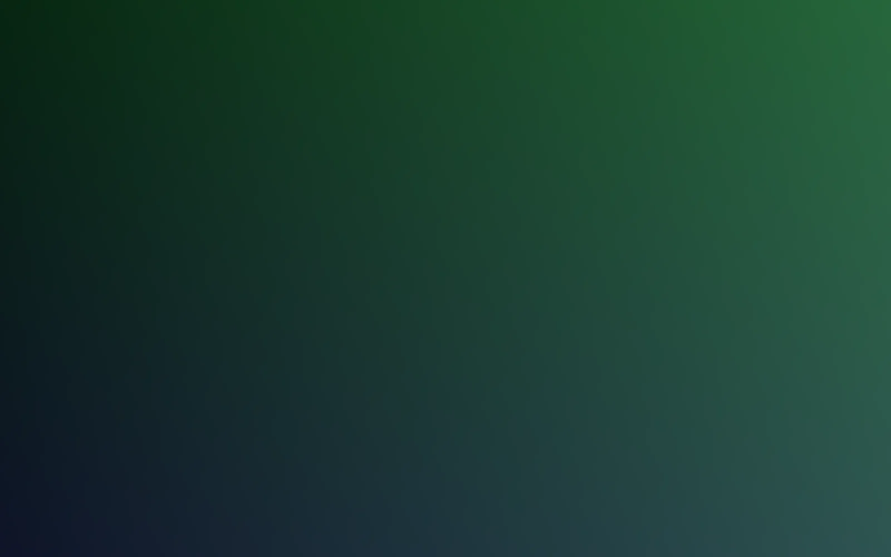
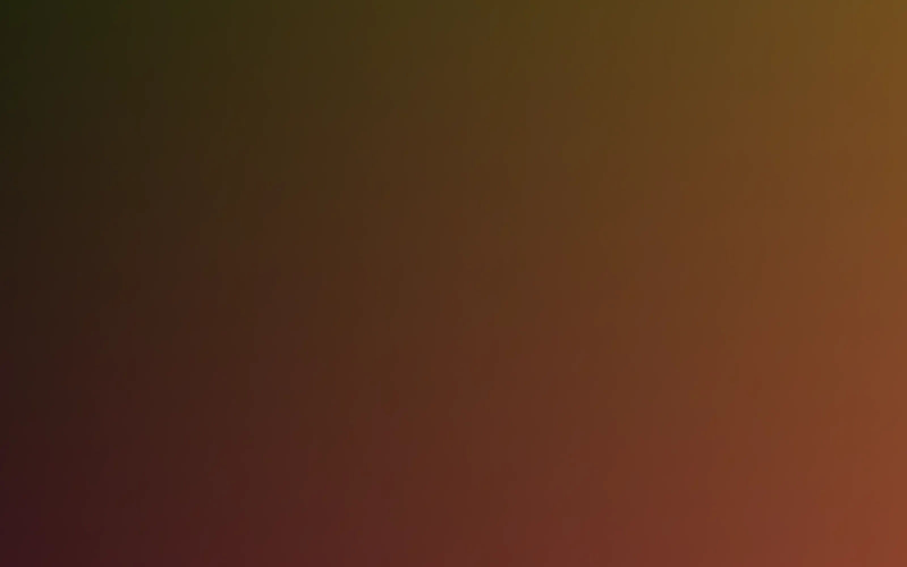
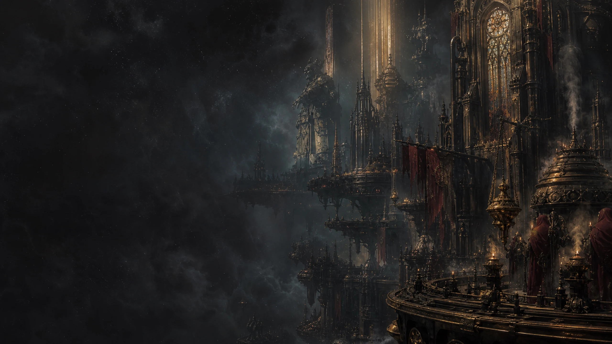

# LingGlow 免费模板

以下模板均包含 Codex/GPT、WorkBuddy、豆包三客户端投影。Codex 使用独立的全局背景和 3:1 新建任务图；WorkBuddy 使用主题匹配的透明替换图。

| 预览 | 模板 |
| --- | --- |
|  | **极光青 Free** (`aurora-free`) 免费三端主题：清透青绿、深色玻璃与高对比文字。 |
|  | **暖沙金 Free** (`amber-free`) 免费三端主题：暖金沙色、咖色玻璃与高对比文字。 |
|  | **哥特虚空远征** (`dream-gothic-void`) Codex Dream Skin 社区原创哥特科幻背景，免费适配 Codex、WorkBuddy 与豆包。 |
|  | **梦境传送门 Free** (`dream-portal-free`) Codex Dream Skin 原创抽象 Portal 艺术扩展的免费三端主题；独立全局背景、关联首页 Hero 与 WorkBuddy 透明传送门精灵。 |

可导入目录：`catalog/`。索引位于 `catalog/theme-packs/index.json`。
